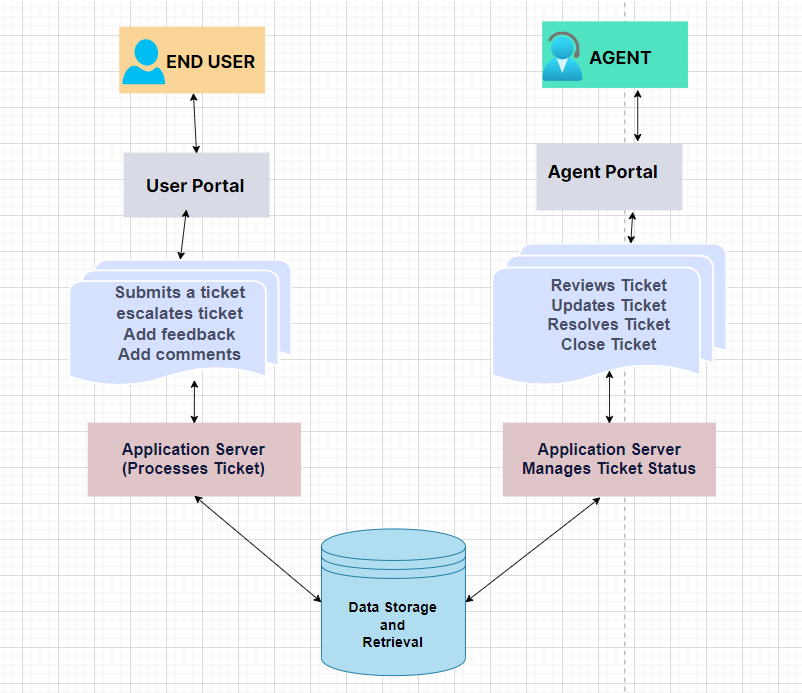
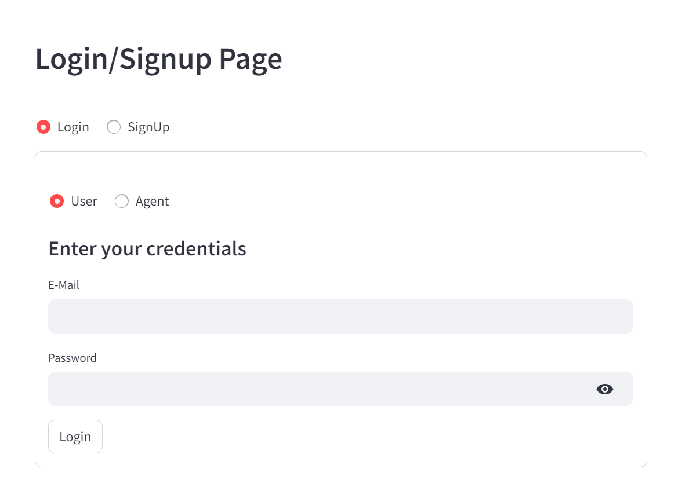
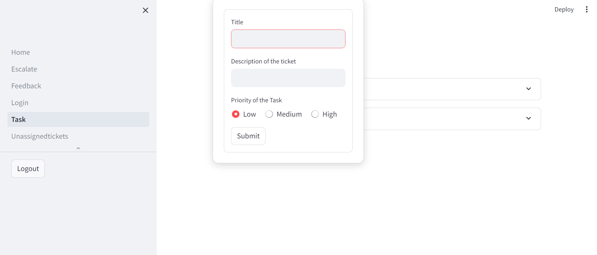
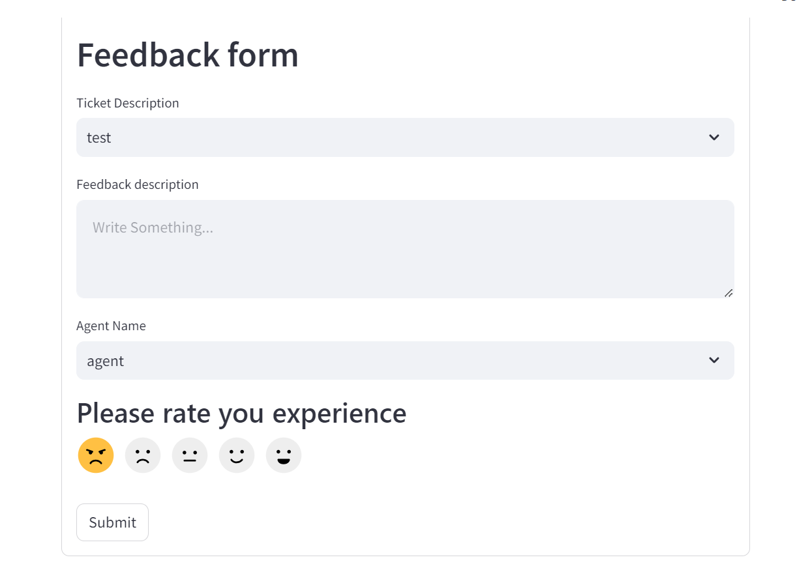
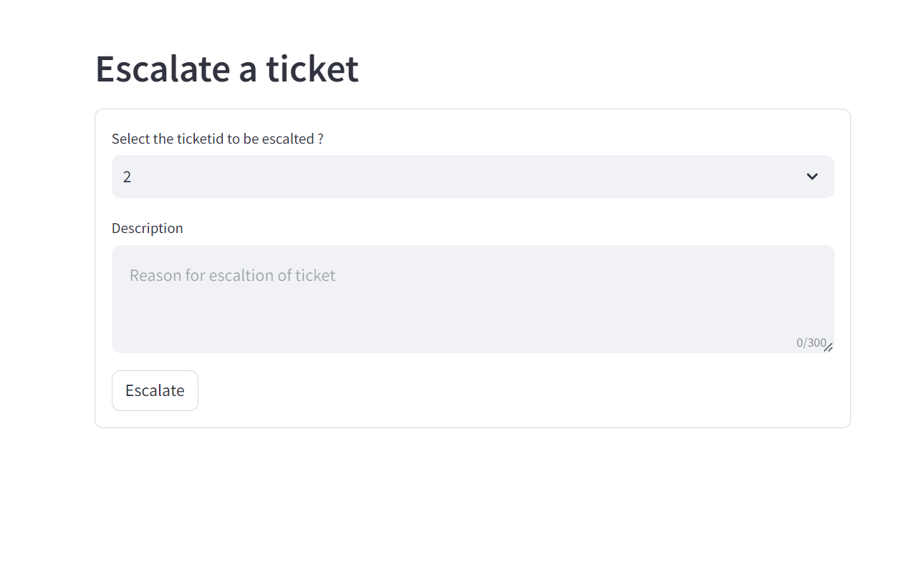
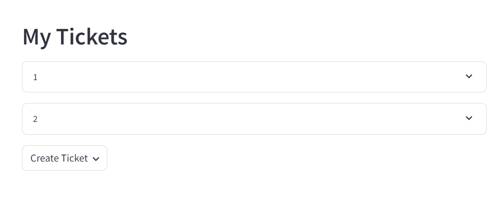
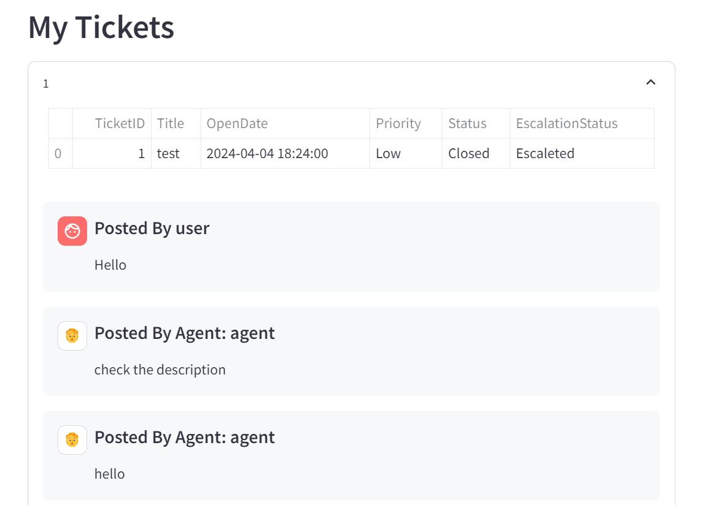
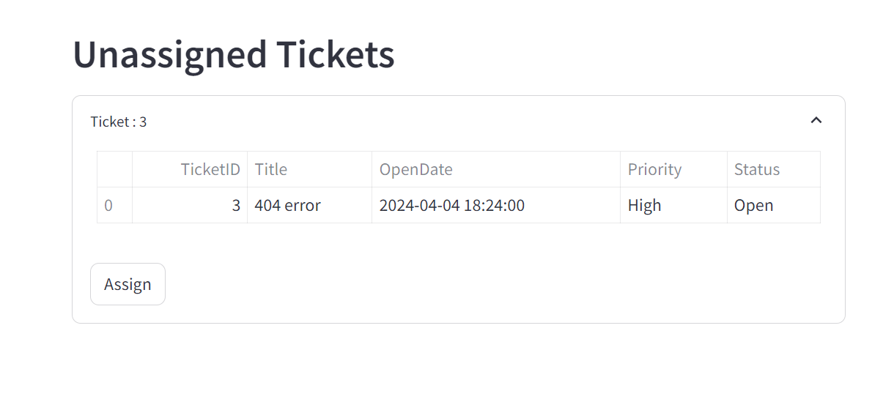
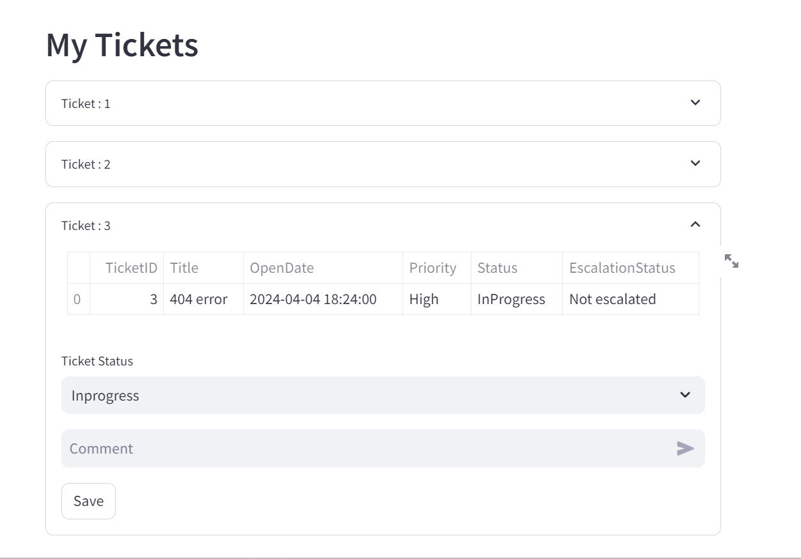

# Software Ticket Management System

## Introduction
The Web-based Ticket Management System is designed to streamline the process of managing support tickets for both customers (users) and support staff (agents). It allows users to submit, track, and update their tickets, while agents can manage, resolve, and communicate directly within the system. The goal is to enhance the efficiency of customer service operations and improve response times.

## Key Features
User Authentication: Secure login and session management for users and agents.
Ticket Management: Users can easily submit tickets; agents can view, update, and close tickets.
Interactive Dashboards: Separate dashboards for users and agents to manage their tasks and communications.

## Technology Stack
#### Python
#### Stremlits
#### Database: MySQL 

## Installation
#### Python 3.8 or newer
#### MySQL 5.7 or newer

## Steps

### Clone the Repository:

1. Open Visual Studio, Clone the repo.
    ```sh
    git clone https://github.com/Sannidhi1112/Software-Ticket-Management-System.git
    ```

2.  Preasumming Python and Pip are installed.
    ```sh
    pip install mysql-connector-python
    ```
    ```sh
    pip install streamlit --user
    ```
    ```sh
    python -m pip install --upgrade streamlit-extras --user
    ```
    ```sh
    pip install streamlit_star_rating --user
    ```

3.  Create the database schema in My SQL Workbench
    ```sh
    CREATE SCHEMA `softwareticketmanagementsystem` ;
    ```
4.  Execute SQL queries in the schema

5. Navigate to the Ticket foler
    ```sh
    cd Ticket
    ```
6.  Run the Home.py
    ```sh
    python -m streamlit run Home.py
    ```

## Running Locally
As described, application is accessible via http://localhost:8501 

## Architecture Diagram
Detailed view of the system interactions and data flow.


This web-based ticket management system provides, users and agents interact through their respective portals, with users submitting tickets via the user portal and agents reviewing and updating them through the agent portal. The application server processes submitted tickets, storing them in the database for retrieval and updates. Agents handle ticket resolution and status updates, with the application server managing status changes and communicating them back to users. Users can view ticket status updates and agent comments, and have the ability to close the ticket. The application server processes these closure and updating the ticket status accordingly in the database. This system ensures efficient communication and resolution of user-reported issues, with clear processes for ticket management and status updates throughout.

This Architecture provides a detailed view of the ticket lifecycle, from submission by the end user to processing by the agent, with all steps in between managed by the application server and database server.

## Screenshots
Here are some snapshots showcasing the functionality of the system:

### User Dashboard

### Ticket Creation

### Feedback Form for User

### Escalation of Ticket for User

### List of submitted tickets for User

### Ticket Data

### Unassigned Ticket for Agent

### List of Assigned Tickets for Agent


## Conclusion
This web-based ticket management system provides a robust solution for handling customer inquiries and support issues, improving the efficiency and effectiveness of customer service operations.